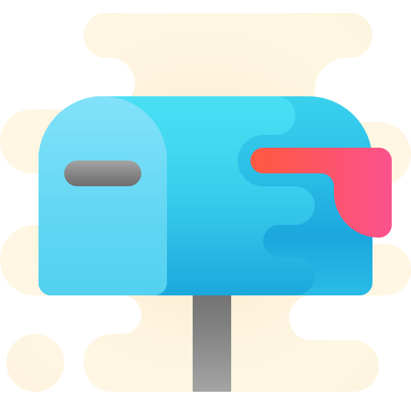
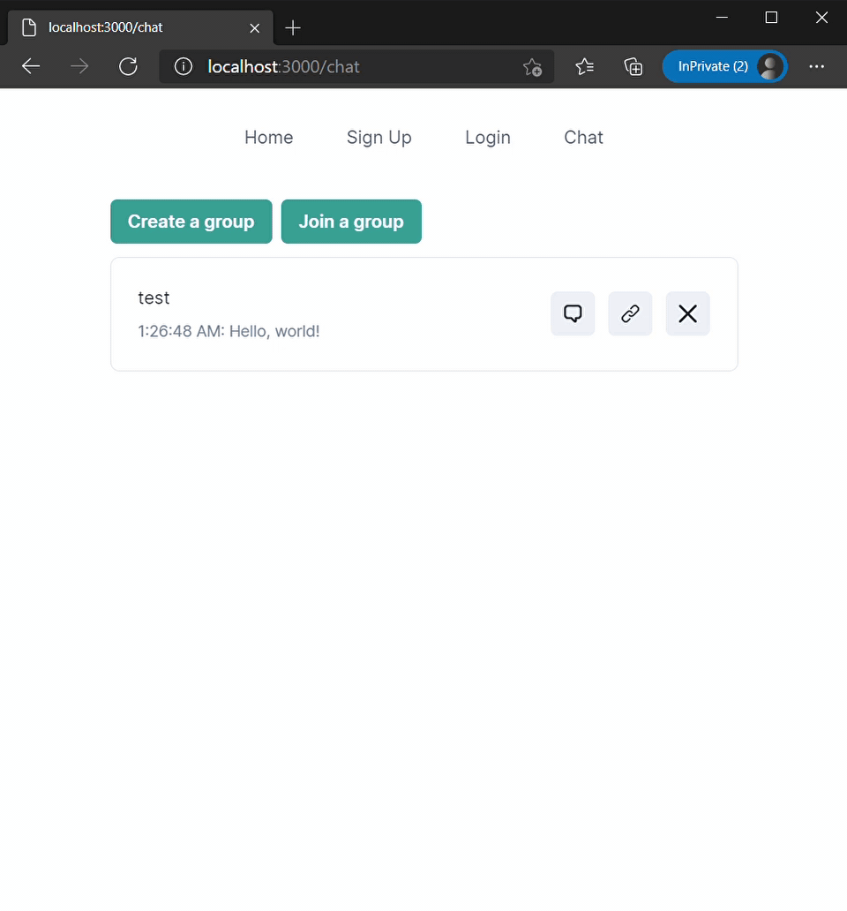

  

<h1 align="center">hermes</h1>

<i>✨ A full-stack ephemeral chat application built with Node.js</i>

  
  
  

# ✨ Demo

  

# 💻 Tech

`hermes` is a full-stack chat app powered by:

- [Docker](https://www.docker.com/) (containerization)
- [PostgreSQL](https://www.postgresql.org/) (database)
- [Prisma](https://www.prisma.io/) (ORM)
- [Type-GraphQL](https://typegraphql.com/) (GraphQL API "framework")
- [Apollo Server](https://www.apollographql.com/) (GraphQL server)
- [Express](https://www.npmjs.com/package/apollo-server-express) (WebSockets, middleware, JWT authentication)
- [Redis](https://redis.io/) (rate limiting)
- [RabbitMQ](https://www.rabbitmq.com/) (push-based message queue)
- [urql](https://formidable.com/open-source/urql/) (GraphQL client)
- [Next.js](https://nextjs.org/) (frontend framework)
- [Chakra UI](chakra-ui.com/) (UI library)

## 🤝 Contributing

Contributions and PRs are welcome! Feel free to check out the [issues page](https://github.com/safinsingh/hermes/issues) if you have a question or an idea. Note: this isn't meant to be an "enterprise-grade" application, so there may be still be some bugs. That said, it was fun to make nontheless, and I'm open to any suggestions you may have!
